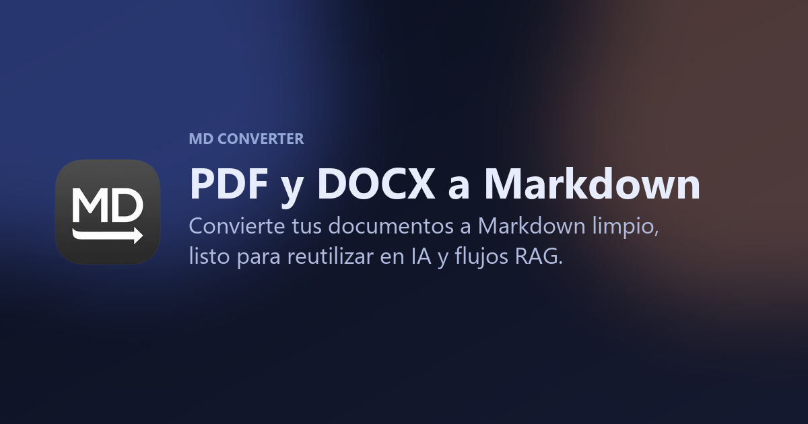

# MD Converter

**Convert PDF and DOCX files into clean, structured Markdown — entirely in your browser.**

MD Converter turns heavy, fragmented documents into lightweight `.md` files that are easy to reuse in AI prompts, RAG pipelines, knowledge bases, and developer workflows. No backend, no uploads, no tracking: every conversion happens on-device.

[](https://md-converter-phi.vercel.app/)
[](https://svelte.dev)
[](https://www.typescriptlang.org/)
[](https://vite.dev)
[](https://tailwindcss.com)
[](https://vitest.dev)
[](LICENSE)



---

## Table of contents

- [Why this project exists](#why-this-project-exists)
- [Features](#features)
- [Tech stack](#tech-stack)
- [Architecture](#architecture)
- [Project structure](#project-structure)
- [Getting started](#getting-started)
- [Available scripts](#available-scripts)
- [Internationalization (i18n)](#internationalization-i18n)
- [Adding a new convertible file format](#adding-a-new-convertible-file-format)
- [Privacy & security](#privacy--security)
- [SEO & SSR pre-rendering](#seo--ssr-pre-rendering)
- [License](#license)

## Why this project exists

PDFs and Word documents are everywhere, but they're a poor fit for AI workflows: layout noise, inconsistent whitespace, and binary formats get in the way of prompts, RAG ingestion, and LLM context windows. `.md` is lighter, structured, and trivially composable — so MD Converter focuses on producing **Markdown that is genuinely usable**, not just technically converted: headings, lists, and tables are preserved wherever the source format allows it, and repeated noise is cleaned up automatically.

## Features

- 📥 **Drag & drop or manual upload** — multiple files at once, with duplicate and unsupported-format detection.
- 🔁 **In-browser conversion** — PDF and DOCX are parsed and converted entirely client-side; files never leave the device.
- 🧠 **Smart text normalization** — heuristics reconstruct headings, bullet/numbered lists, and whitespace from raw extracted text.
- 📊 **Markdown tables from DOCX** — a custom Turndown rule renders real Markdown tables instead of flattened text.
- 👀 **Live preview** — toggle between plain Markdown and sanitized rendered HTML (via `marked` + `DOMPurify`) for each result.
- 📄 **Per-file or batch export** — download a single `.md`, copy it to the clipboard, or download every successful result as a `.zip`.
- 📶 **Real-time progress feedback** — per-page progress during conversion, plus success/error/partial-failure states with actionable messages.
- 🌐 **Bilingual UI (ES/EN)** — auto-detected from the browser language, switchable at runtime, and persisted to `localStorage`.
- 🔍 **SEO-ready** — server-side pre-rendering injects fully-rendered `<head>` metadata, Open Graph/Twitter tags, JSON-LD structured data, `sitemap.xml`, and `robots.txt` into the shipped HTML.
- ♿ **Accessible by design** — keyboard-operable dropzone, ARIA labels, and focus-visible states throughout.

## Tech stack

| Layer            | Choice                                                          |
| ----------------- | ---------------------------------------------------------------- |
| UI framework      | [Svelte 5](https://svelte.dev) (runes-free, store-based reactivity) |
| Language          | TypeScript (strict)                                              |
| Build tool         | [Vite 7](https://vite.dev)                                       |
| Styling            | [Tailwind CSS](https://tailwindcss.com) (utility-first, mostly in markup) |
| PDF parsing        | [pdfjs-dist](https://www.npmjs.com/package/pdfjs-dist)           |
| DOCX → HTML        | [mammoth](https://www.npmjs.com/package/mammoth)                 |
| HTML → Markdown    | [turndown](https://www.npmjs.com/package/turndown) (custom table rule) |
| Markdown rendering | [marked](https://www.npmjs.com/package/marked) + [dompurify](https://www.npmjs.com/package/dompurify) |
| Batch export       | [jszip](https://www.npmjs.com/package/jszip)                     |
| Testing            | [Vitest](https://vitest.dev) + `jsdom`                           |
| Linting            | ESLint (`typescript-eslint` + `eslint-plugin-svelte`)            |
| Package manager    | [pnpm](https://pnpm.io)                                          |

## Architecture

MD Converter is a **client-side-only** app: there is no API, no server-side state, and no document ever leaves the browser.

`App.svelte` is the single stateful root component. Every other component is presentational, receiving data and callbacks as props — the only shared global state is the locale store. The data flow is:

1. **Upload** — `UploadDropzone` reports drag/drop or file-picker input back to `App.svelte`, which validates files (`utils/file.ts`) against an extension/MIME allowlist (`config/files.ts`) and de-duplicates by an id derived from name + size + `lastModified` + type.
2. **Convert** — `handleConvert` iterates uploaded files and calls `services/conversion.ts#convertFile`, which dispatches by extension:
   - **PDF** → `pdfjs-dist` extracts text per page, reconstructs lines from text-content items using `hasEOL`, then runs the result through `normalizeExtractedText` (heading/bullet/numbered-list/whitespace heuristics).
   - **DOCX** → `mammoth` converts DOCX → HTML, piped through `turndown` (HTML → Markdown), with a custom Turndown table rule (`renderMarkdownTable`) for proper Markdown tables.
   - Both paths funnel through `normalizeExtractedText` and `createResultItem` / `createErrorResultItem` to build a typed `ResultItem`, reporting per-page progress via a callback.
3. **Preview / export** — Results render as plain text or, via `marked` + `dompurify`, as sanitized HTML in `PreviewPanel`. Each file downloads as `.md` (`utils/download.ts`); "download all" zips every successful result with `jszip`.

```
Upload (drag/drop, picker)
        │  validate + dedupe
        ▼
convertFile(item) ──┬─ PDF  → pdfjs-dist → normalizeExtractedText
                     └─ DOCX → mammoth → turndown (+ table rule) → normalizeExtractedText
        │
        ▼
ResultItem[] ──► PreviewPanel (plain | sanitized HTML)
        │
        └──► download .md  |  download all as .zip  |  copy to clipboard
```

## Project structure

```
src/
├── components/
│   ├── hero/         # Landing hero + "why this exists" section
│   ├── upload/        # Drag & drop / file picker
│   ├── conversion/     # Convert button, progress, status
│   ├── workspace/      # File list, per-file results, Markdown preview
│   ├── feedback/       # Floating "copied!" / "downloaded!" tips
│   ├── locale/         # Language switcher
│   └── icons/          # SVG icon components
├── services/
│   └── conversion.ts   # PDF/DOCX → Markdown conversion pipeline
├── utils/               # Pure helpers: file validation, downloads, sanitization
├── config/               # Shared constants (allowed formats, UI timings)
├── types/                # Domain types (ResultItem, FileKind, …)
├── i18n/                 # es/en dictionaries + translation engine
├── stores/                # Svelte store for locale + i18n binding
├── App.svelte             # Single stateful root component
├── main.ts                # Client entry point
└── entry-server.ts        # SSR entry point used by the pre-render step

scripts/
└── prerender.mjs          # Post-build step: injects SSR-rendered <head> + markup into dist/index.html
```

## Getting started

**Prerequisites:** Node.js ≥ 18 and [pnpm](https://pnpm.io) (the project uses `pnpm-lock.yaml`).

```bash
# Clone
git clone https://github.com/bosch0/.MD-Converter.git
cd .MD-Converter

# Install dependencies
pnpm install

# Start the dev server
pnpm dev
```

Open the printed local URL — uploading a sample PDF or DOCX works immediately, no environment variables or backend setup required.

## Available scripts

| Command          | Description                                                                 |
| ----------------- | ----------------------------------------------------------------------------- |
| `pnpm dev`         | Start the Vite dev server with HMR.                                           |
| `pnpm build`        | Production build: client bundle + SSR bundle + `scripts/prerender.mjs`, output to `dist/`. |
| `pnpm preview`       | Preview the production build locally.                                        |
| `pnpm check`         | Type-check (`svelte-check` against `tsconfig.app.json` + `tsc` against `tsconfig.node.json`). |
| `pnpm lint`           | Run ESLint over the whole repo (TS + Svelte).                                |
| `pnpm test`           | Run all Vitest unit tests once.                                              |
| `pnpm test -- -t "name"` | Run tests matching a specific name.                                      |

## Internationalization (i18n)

Every user-facing string flows through a typed translation function `t` — nothing is hardcoded in components.

- `i18n/locales/{es,en}.ts` hold the dictionaries. `es.ts` is the **source of truth** for the `TranslationKey` type (`i18n/types.ts` derives keys from `typeof esMessages`), so a key added only to `en.ts` won't be type-checked the same way — always add new keys to **both** files, keyed off `es`.
- `stores/locale.ts` is a Svelte store (`locale`, derived `t`) that resolves the initial locale from `localStorage` (`md-converter.locale`) or the browser's language, and `setLocale(locale, { persist })` updates and persists it.
- Interpolation uses `{paramName}` placeholders resolved by `i18n/index.ts#formatMessage`.

## Adding a new convertible file format

To extend conversion support, touch these files in order:

1. `config/files.ts` — extension/MIME allowlist + `FILE_INPUT_ACCEPT`.
2. `types/conversion.ts` — extend `FileKind`.
3. `utils/file.ts` — `getFileKind` / label mapping.
4. `services/conversion.ts` — new `convert*File` branch inside `convertFile`.
5. `i18n/locales/{es,en}.ts` — add the corresponding `fileKind.*` keys to **both** locales.

## Privacy & security

- **No backend, no uploads.** Every PDF/DOCX is parsed and converted in the browser; nothing is sent to a server.
- **Sanitized rendering.** Markdown preview HTML is generated with `marked` and passed through `DOMPurify` (`utils/sanitize.ts`) before being injected into the DOM, preventing XSS from malicious document content.
- **No analytics, no third-party trackers.**

## SEO & SSR pre-rendering

Although the app is client-side-only at runtime, `pnpm build` also renders `App.svelte` server-side (`entry-server.ts`) and splices the result into `dist/index.html` via `scripts/prerender.mjs`. This means the shipped HTML ships with real, locale-aware `<title>`, meta description, Open Graph/Twitter tags, canonical/hreflang links, and JSON-LD structured data — instead of an empty `<div id="app">` — so crawlers and social previews see fully-formed content without running JavaScript.

## License

Released under the [MIT License](LICENSE).
